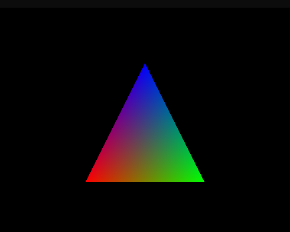
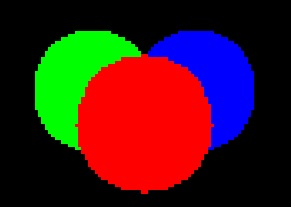

# Raytracer
A Raytracer to display Spheres and Triangle based objects (Mesh)

# Build (Windows Only)
Build with Raytracer.sln solution from Visual Studio 2019

# Sphere Ray-Tracing Check-List
- [x] Basic Sphere Raytracing
- [x] Lighting
    - [x] Diffuse Reflection
    - [x] Specular Reflection
- [x] Arbitrary Camera Positioning and Rotation
- [x] Shadows
- [x] Object Reflection
- [x] Optimization
    - Initial
        - Setup: 0.220ms
        - Running: 4261.06ms
    - Current
        - Setup: 0.564ms
        - Running: 1594.48ms

# Triangle Ray-Tracing Check-List
- [x] Basic Triangle Raytracing
- [x] Barycentric Coordinates
- [x] Moller-Trumbore Algorithm
- [ ] Load Wavefront .obj file
- [ ] Render .obj files
- [ ] Refactor code to render multiple shapes within one scene (Polymorphism)

# Current State of Triangle Raytracing

# Current State of Sphere Raytracing
