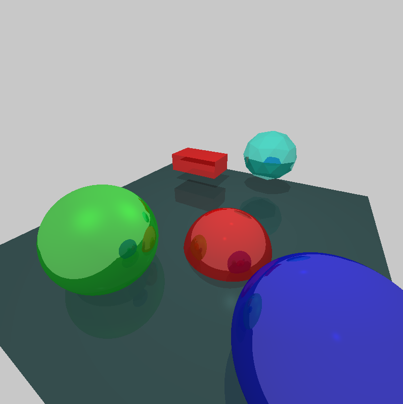
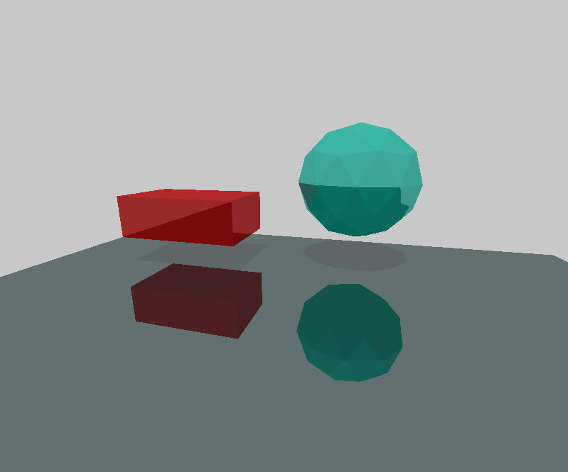
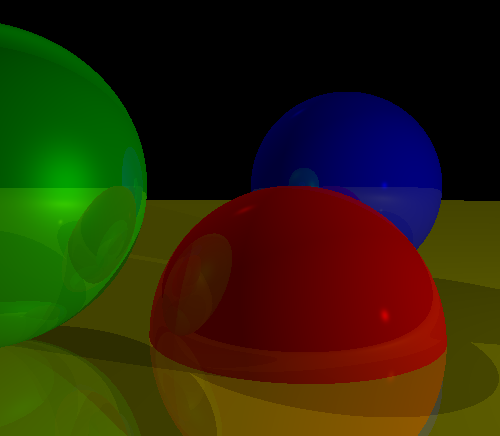

# Raytracer
A Raytracer to display Spheres and Triangle based objects (Mesh)

# Dependencies
- GLFW 3.3.8

# Build (Windows Only)
Build with Raytracer.sln solution from Visual Studio 2022

# Sphere Ray-Tracing Check-List
- [x] Basic Sphere Raytracing
- [x] Lighting
    - [x] Diffuse Reflection
    - [x] Specular Reflection
- [x] Arbitrary Camera Positioning and Rotation
- [x] Shadows
- [x] Object Reflection

# Triangle Ray-Tracing Check-List
- [x] Basic Triangle Raytracing
- [x] Barycentric Coordinates
- [x] Moller-Trumbore Algorithm
- [x] Load Wavefront .obj file
- [x] Render .obj files

# Ray-Tracing Check-List
- [x] Refactor code to render multiple shapes within one scene
- [x] Multi-Threaded
- [x] GLFW for window display

# Sphere and Triangle Raytracing

# Triangle Raytracing

# Sphere Raytracing
